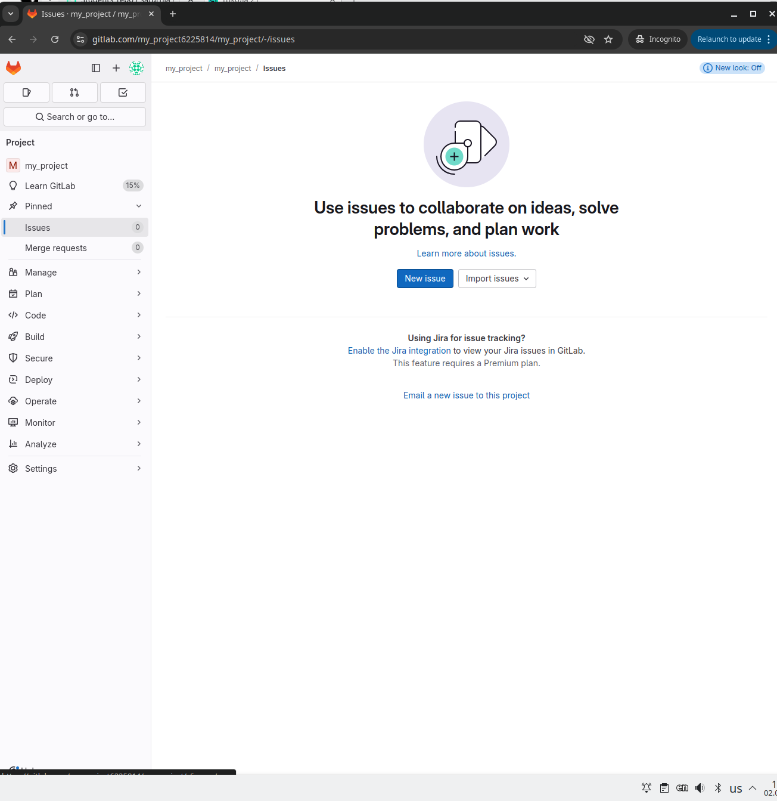

#  README.md  

## 1. Создание личного репозитория  
## С нужным .gitignore   
### И README.MD  
  
## В этом разделе ты узнаешь:   
1. Создание локального репозитория с нуля    
2. Добавим README  
3. Настройка .gitignore  
4. Первый commit  
5. Cоздание удаленного репозитория   
6. Необходимые проверки!  

### Создание локального репозитория с нуля  
  
**Первым делом, главное**  

Открываю bash и пишу команды для создания папок, проекта в котором будут содержаться все файлы!  

```  
mkdir myProject  
cd myProject  
//как-то наполняю проект файлами, программами и скриптами - для работы проекта  
ls //убедиться, что проект на месте, все права сохранены(на редактирование)  
git init  
```
Теперь у нас существует пустой локальный репозиторий! Можно перед добавлением проекта, добавить файл READEME.MD 
  

### Добавляем README.md  
  
Описать проект лучше всего в файле README.md   
  
```  
bash   
echo "# My Project" > README.md  
// или   
vim README.md  
```  
```  
md  
My Project  
Этот репозиторий создан для тестинга!  
```  

Не забудь сохранить изменения, если работаешь через vim  
('Esc ->:wq')  
  
# Настройка .gitignore   
  
Файл .gitignore указывает, какие файлы не нужно добавлять в репозиторий.  
Создадим его:  
```  
bash  
touch .gitignore  
vim .gitignore  
```
  
После запишем все файлы, которые нужно игнорировать, временные файлы, системные и сгенерированные файлы, которые не должны попасть в Git-репозитороий:  

```  
gitignore  
Игнорируем системные файлы  
~* // временные файлы редакторов(например file.txt~ в vim)  
.nfs* //файлы создаваемые при работе с NFS(сетевые хранилища)  

Игнорируем логи  

*.log //любые фалы логов(syslog.log, error.log)  

logs/ //директория, в которой храянятся логи.  

var/log/ // системные логи(лучше не добавлять в репозиторий)  

Игнорируем файлы окружения  

.env // файлы с переменными окруженния  

*.env  

.config/ //конфигурационные файлы пользовательских приложений  

Игнорируем кеши зависимостей  

nodes_modules/ //зависимости для Nodes.js  

vendor/ // зависимости PHP  

.cache/ // кеш приложений  

Игнорируем скомпелированный код  

*.o // объектные файлы после компиляции (gcc -c)  

*.so // динамические библиотеки (.so в Linux -аналог .dll в Windows)  

*.out // исполняемые файлы(например a.out)  

*.exe // исполняемые файлы Windows  

Игнорируем файлы и каталоги IDE и редакторов  

.idea/ // настройки  JetBrains(IntelliJ IDEA)  

.vscode/ // настройки Visual Studio Code  

*.swp // времнные файлы vim  


Игнорируем файлы сгенерированные во время исполнения  

*.pid - файлы с ID процессов (process.pid)  

/tmp/ // временные файлы  

*.pyc  

__pycache__/ //скомпелированные файлы  

```  

### Делаем первый коммит и создание удалённого репозитория  

Добавляем файлы в Git и фиксируем изменения:  

```  
bash  
git add <имя_папки>  
git commit -m "Инициализация проекта на удалённый репозиторий"```  

1. Заходим на GitLab 
2. Нажимаем "New project"  
3. Вводим имя, например my_project, и нажимаю "Create repository"  
4. GitLAb предложит команду для привязки удалённого репозитория через HTTPS, но он не раюотает с августа месяца, пожтому воспользуемся SSH:  
```  
bash  
git remote add origin git@gitlab.com:ТВОЙ_ЛОГИН/my_project.gi  
git branch -m <название_ветки>  

git push -u origin <название_ветки>  
  
## Profit!!!  

Проверь SSH:  

```  
bash  
ssh -T git@gitlab.com  
```  

Если подключение успешно, то увидишь
```  
bash  
Welcome to GitLab, @Login    
```  

  

## 2.Создание веток master и develop  

```  
bash
git checkout -b master
git push -u origin master
git checkout -b develop
git push -u origin develop  
```  

  

  

  

  


## 3. Установка develop как default branch  

Settings → Repository → Default branch → Выбрать "develop"  

## 4. Создание Issue  

Issues → New Issue → Укажите заголовок ("Создать мануал") и описание  


  

 

  

## 5. Ветка по Issue  

При создании Issue используйте кнопку "Create branch" или вручную:  

```
bash

git checkout -b docs/manual-issue-1  
```
## 6. Merge Request (MR)
После коммитов в ветке:

Нажмите "Create merge request"

Укажите target branch develop

Create MR  

  


## 7. Ревью и принятие MR  

Проверьте Changes

Добавьте комментарии при необходимости

Нажмите "Merge"

## 8. Релиз в master
```  
bash
git checkout master
git merge --no-ff develop
git tag -a v1.0 -m "Stable manual version"
git push --tags  
```
## 9. Wiki проекта  

В боковом меню выберите Wiki → Создайте страницы с документацией
